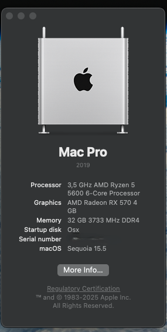

# ASUS ROG Strix B550-F Gaming (Ryzen 5 5600 + RX 470/570)

## 🖥️ About this repository

This OpenCore config was created and tested for macOS Sequoia (15.x) installation on a PC. The configuration is fully functional and can serve as a starting point for similar systems.

**⚠️ IMPORTANT**: This config was prepared for a specific hardware configuration. Do not copy it directly - you must adapt it to your hardware!

## 🔧 Hardware Specification

| Component | Model |
|-----------|-------|
| **Motherboard** | Asus ROG Strix B550-F GAMING |
| **CPU** | AMD Ryzen 5 5600 |
| **GPU** | ASUS RX 470 Mining 4GB (Flashed RX 570 BIOS) |
| **GPU2** | ASUS RTX 3060 Ti 8GB |
| **RAM** | 32 GB Kingston Beast 3733Mhz DDR4 |
| **Storage** | Goodram CX-400 1TB GB SSD |
| **Audio** | Integrated ALCS1220A |
| **Ethernet** | 1 x Intel® 2.5Gb Ethernet |
| **Bluetooth** | Baseus BA04 USB Dongle |

## ✅ What works

- [x] **System boot** - Full support for OpenCore bootloader
- [x] **CPU** 
- [x] **GPU1** - GPU2 must be disabled
- [x] **Audio** - Internal Speakers - other outputs not tested
- [x] **Ethernet** - Wired connection
- [x] **Bluetooth** 
- [x] **USB** - All USB ports (2.0, 3.0, 3.1, USB-C)
- [x] **Sleep/Wake** - Sleep mode and wake up
- [x] **iServices** - not tested

## ❌ What doesn't work

Not enough time for full hardware validation

## 📸 Screenshots
 

## 📋 Prerequisites

Before installing, make sure you have:

- USB drive (16GB minimum)
- [OpenCore](https://github.com/acidanthera/OpenCorePkg/releases) (latest release)
- [ProperTree](https://github.com/corpnewt/ProperTree) or [OpenCore Auxiliary Tools](https://github.com/ic005k/OCAuxiliaryTools)
- macOS Sequoia installer
- Basic knowledge of terminal/command line

## 🚀 Installation

1. **Prepare USB installer**
   - Download macOS Sequoia from App Store or Apple Developer Portal
   - Create bootable USB using Terminal or third-party tools

2. **EFI Setup**
   - Copy EFI folder to your USB EFI partition
   - Generate new SMBIOS data using GenSMBIOS
   - Configure config.plist for your hardware

3. **BIOS Configuration**
   - Apply settings listed below
   - Save and exit BIOS

4. **Install macOS**
   - Boot from USB
   - Install macOS following on-screen instructions
   - Copy EFI to internal drive after installation

## ⚙️ BIOS/UEFI Configuration

### Disable:
- CFG Lock
- CSM Support
- Secure Boot
- Serial/COM Port
- Parallel Port

### Enable:
- UEFI Boot Mode
- Above 4G Decoding
- Hyper-Threading
- EHCI/XHCI Hand-off
- Resize Bar

### Set:
- SATA Mode: AHCI
- Boot Priority: USB first
- Fast Boot: Disabled

## 🔗 Useful links

- [Official OpenCore Guide](https://dortania.github.io/OpenCore-Install-Guide/)
- [AMD Vanilla Patches](https://github.com/AMD-OSX/AMD_Vanilla)
- [r/hackintosh](https://www.reddit.com/r/hackintosh/)
- [Kext repository](https://kexts.goldfish64.com/)
- [OpenCore Sanity Checker](https://opencore.slowgeek.com/)
- [Hackintool](https://github.com/headkaze/Hackintool)

## 🙏 Acknowledgments

- [Acidanthera](https://github.com/acidanthera) for OpenCore and essential kexts
- [Dortania](https://github.com/dortania) for comprehensive guides
- [AMD-OSX](https://github.com/AMD-OSX) for AMD kernel patches
- Hackintosh community for continuous support and development

## ⚖️ Disclaimer

**LEGAL NOTICE**: This project is for educational purposes only. Using macOS on hardware other than Apple's may violate Apple's End User License Agreement (EULA). Use at your own risk.

- The author is not responsible for any damages resulting from the use of this config
- This repository does not contain any files proprietary to Apple
- Support Apple by purchasing original products
- This project is not for commercial profit
- Always backup your data before attempting installation

---

**💡 Tip**: If this config helped you, consider leaving a star ⭐ on GitHub!

## 📄 License

This project is released under the MIT License. See [LICENSE](LICENSE) for more information.

---
